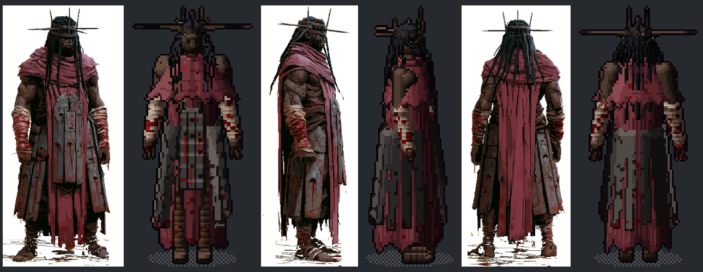
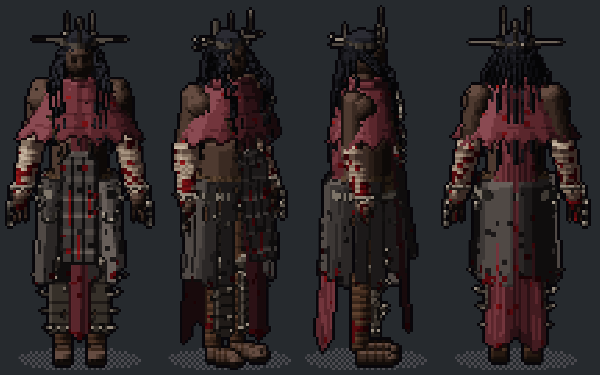
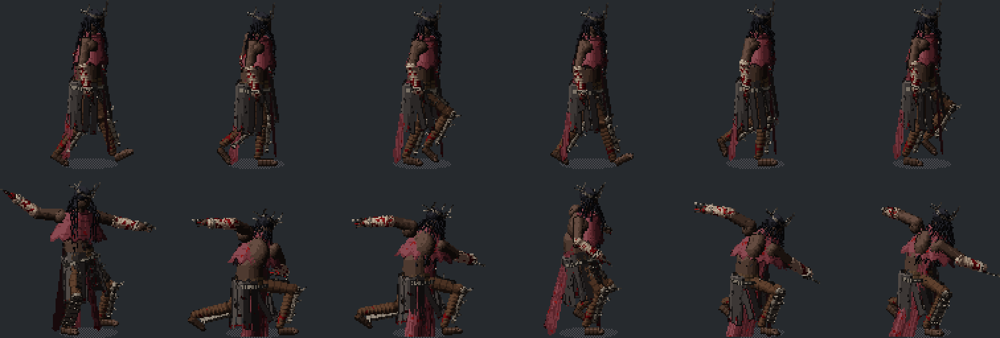

# Hemomancer: the shape-sprite build (2026-10-04)

The Hemomancer now in the game (`art/sprites/hemomancer.*`, mapped in `art/sprites/skins.json`) is a **shape sprite**:
a character written as named 3D shapes (`tools/pixelforge/assets/shapes/characters/hemomancer.shapes.json`, 173 shapes),
drawn as pixel art by the Forge's shape renderer and animated by the motion clips in all 8 directions. No cutout, no
Blender. It replaces both the old painter set and Hemomancer test 1 (`../test1/`), the cutout-and-Blender build that came
out as a blob.

Source: Derek's three-view Midjourney sheet (`../test1/sheet_original.png`).

| | |
|---|---|
|  | Painting (left of each pair) vs the sprite, front / side / back, after the colour and proportion pass |
|  | Final look at 120 px: S, SE, E, N |
|  | The plank skirt in the walk and the attack lunge, after the per-leg fix |

Animated, all 8 directions: `walk.gif`, `attack.gif`, `cast.gif`, `idle.gif`.

## How it was made

The file is written by `make_hemomancer_shapes.py` (in this folder; run it with the Forge's Python and it rewrites the
shape file). Planks, spikes, locs and chain links are placed by loops there instead of by hand-copying 170 entries.

1. **First draft from the sheet by eye**, around the 120 px author pose (`pixelforge shapes template --height 120`):
   head with brow, eye sockets, nose, mouth; black locs as a hair cap plus strands (9 down the back, 6 in front of the
   shoulders, two capsules each so they follow the mantle and cape); an iron crown band with spikes; crimson cowl, mantle,
   a front tabard and a back cape as rings; bare muscular arms; bandaged forearms with blood; plank skirt as separate
   boxes turned around the hips; the plank shield (a box plus a prism arch, tilted back); wrapped legs and bare feet.
2. **Matched to the painting side by side** (painting and sprite at one height):
   - colours re-picked from the painting: darker, less saturated skin; a dusty muted crimson instead of pink; weathered
     warm-grey planks; lighter linen bandages;
   - the red is a *narrow* strip down the front and a narrow cape down the back, not a wide red skirt;
   - the mantle drapes wide over the shoulders; the shield runs chest to thigh; the locs reach the belly in front and
     mid-back behind; fewer, longer spikes on the crown;
   - blood cut from speckle everywhere to stains, drips under the shield holes and at the plank ends (speckle read as
     noise at sprite size); the forehead blood removed (it read as a red dot).
3. **Derek's notes, round 2**: crown side spikes halved (22 to 10 units); **spiked iron greaves** (rusted plate with rivets,
   a row of spikes out the outer side of each shin, two forward, a big knee spike up and out, a knee plate) and iron
   thigh plates with a spike; **chains** (links as alternating face-on / edge-on ovals: one across the chest, one round
   the waist over the planks with two loops hanging in front, a shackle on each wrist with a broken chain); beard and
   cheekbones; brighter rusted iron so the metal reads. Planks shortened to just below the knee so the greaves show.
4. **The cape bug**: `keep: {"back": 0.62}` was meant as "a strip 0.62 rad either side of the back"; it means "keep
   everything more than 0.62 rad from the front", so the cape wrapped round and hid the legs. Fixed to `{"back": 2.42}`.
5. **The plank skirt did not bend** (Derek: "the iron skirt doesnt bend correctly"): it was one rigid barrel on the hips,
   so the thighs went through it. Now the planks over each leg ride that thigh (`planks_L` / `planks_R`, `hang` 0.3),
   the back planks stay on the hips. That still locked the front planks rigid in the attack lunge, because the rig judges
   "lying down" by the part's own bone and a raised thigh looks like a fallen body. **Engine change:** a part may set
   `"upright_from": "hips"` (`tools/pixelforge/pixelforge/shape_rig.py`, `bone_delta`), so the planks keep hanging from
   the belt and the thigh comes out from under them. Default behaviour is unchanged; `tests/test_shapes.py` 37 passed.
   Documented in `tools/pixelforge/docs/GUIDE_AI.md` (with the `keep` trap).
6. **Into the game at the right size**: rendered with the `godmarrow` preset (195 px, the heroes' size; the guide's
   `gothic_hd` is 120 px and he looked small), exported as kind `hemomancer` over the old painter set (git has the old
   one), and `"hemomancer": "hemomancer"` added to `skins.json`: without it the game's hero loader prefers
   `hemomancer_unclipped.json` (an old painter variant) and the new set is never used. Checked in the running game on the
   Moor (`--cls=hemomancer --new --zone=moor`).

To rebuild after editing the file (from `tools/pixelforge`, Forge project at `~/PixelForge Projects/godmarrow`):

```
python ../../docs/concepts/hemomancer/shapes/make_hemomancer_shapes.py
python -m pixelforge shapes validate assets/shapes/characters/hemomancer.shapes.json
python -m pixelforge project import-shapes hemomancer assets/shapes/characters/hemomancer.shapes.json -p <project>
python -m pixelforge project render-shapes hemomancer -p <project> --style godmarrow
python -m pixelforge project export-game hemomancer --kind hemomancer --out ../../art/sprites --category hero --name Hemomancer -p <project>
```

## Still short

The face is a few pixels and reads as a dark shape; the chest chain is mostly lost under the locs and the red strip
facing south; the shield's arched top reads square; the attack is the stock clip (a wide kicking lunge) and does not
suit him; the cloth is kinematic (it swings late, it does not fold).

## Why the first build was a blob, and what PixelForge needs

The first build (test 1) used `pixelforge hero`, the old cutout road, although shape sprites have been the character
road since 2026-10-02 (HANDOFF 7.8). What let that happen, and the fixes, in order:

1. **The docs still point at the old road.** Both CLAUDE.md files describe the Forge as "Midjourney -> cutouts ->
   Blender"; `hero` is the easiest one-liner and does not say it is the old road. *Fix:* point `hero` and the app's
   character bench at shapes, say so in both CLAUDE.md files.
2. **The wrong size by default.** The guide says `gothic_hd` (120 px) for characters; the game's heroes are 195 px
   (`godmarrow` preset). *Fix:* default characters to the game's hero height; warn when an export does not match.
3. **No painting-to-shapes.** The shape road starts from words (`shapes draft`), so a concept sheet is copied by eye
   over several rounds. *Fix:* read the figure's widths per height from the front and side views to size the rings and
   limbs, sample the painting's regions into material ramps, and a `shapes compare FILE --ref sheet` that lays painting
   and sprite side by side at one height.
4. **Traps in the format.** `keep.back` reads backwards; thigh-hung plates locked rigid; `prism` takes a 2D centre while
   the other kinds take 3D; the validator caught none of the visible problems. *Fix:* a clearer `keep` (a back-strip
   width), `upright_from` (done), validator warnings when cloth hides the legs or a hanging part locks to a raised limb.
5. **No parts kit.** Chains, spikes, rivet rows, per-leg plank skirts, greaves, shackles, locs and back capes were all
   written from scratch. *Fix:* a library of these as functions the next character reuses.
6. **Fragile game install.** `export-game` does not touch `skins.json`, and the hero loader silently prefers an old
   `<kind>_unclipped` file. *Fix:* the export writes the skins entry, and the PixelForge set wins over `_unclipped`.
7. **The old road was untested on real Blender.** Two crashes on the way (`check_spec` on the front-only spec, and
   `fit_template.py` rejecting `--top`), fixed in 3fc4fd8.
