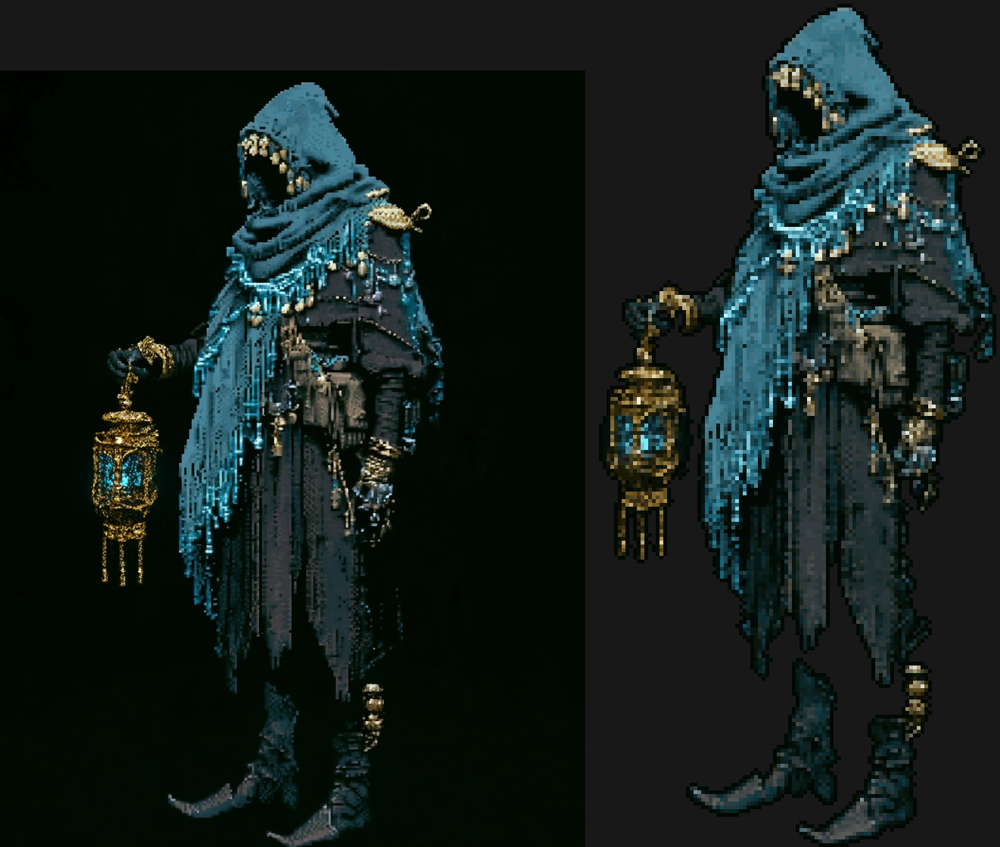
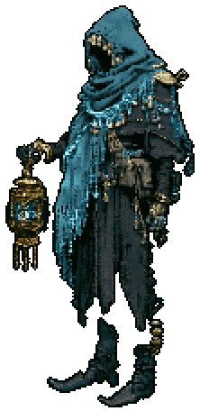
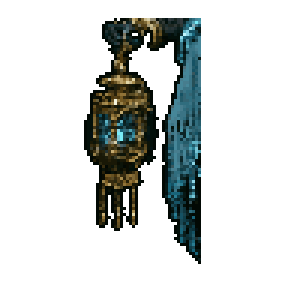

# PixelForge

Turn AI images into real, animated, Godot-ready pixel art — on a normal laptop,
no graphics card. Built for a Diablo 2 style game: characters rendered from 8
directions, every animation, one consistent look.

| Midjourney render → pixel sprite | Animated from one still | Rotated / spun without blur |
|---|---|---|
|  |  |  |

## What's in the box

- **PixelForge Studio** — a desktop app (Windows; pure Python) that walks you
  through: prompts → import → cut out → palette → 3D model → Mixamo → render 8
  directions → pixelate → Godot export. The Midjourney prompts are built in.
- **`pixelforge` command line** — every app step as a command with `--json`,
  plus lower-level tools (`pixelate`, `frames`, `animate`, `rotate`, `pack`,
  `godot`). An AI can run the whole pipeline: see `docs/GUIDE_AI.md`.
- **MCP server** (`pixelforge mcp`) for Claude Desktop / Claude Code.
- **Blender scripts** that build an "inflated cutout" model from a front view,
  paint it with the art, import Mixamo animations, and batch-render sprites.

## Quick start (Windows)

1. Install Python 3.11+ (tick *Add to PATH*).
2. Download this repo, double-click `install.bat`, then `PixelForge Studio.bat`.
3. Read `docs/GUIDE_HUMANS.md` (5 minutes).

Command line, any OS:

```sh
pip install -e .
pixelforge pixelate render.png -o sprite.png --remove-bg --crop --outline auto   # one image -> sprite
pixelforge animate sprite.png -o frames --preset idle --gif                       # still -> looping clip
pixelforge project new MyGame && cd MyGame
pixelforge project add wraith --describe "a gaunt hooded wanderer with a gold lantern"
pixelforge project prompts wraith            # copy prompt A (sheet) + C (sprite) into Midjourney
pixelforge project import wraith sheet sheet.png
pixelforge project run-all wraith            # split -> palette -> model -> (you: Mixamo) -> render -> pixelate -> export
```

## Quality tiers

`--style 8bit` (64 px, 12 colors) · `16bit` (128 px, 32) · `snes` (160 px, 48) ·
`hd` (224 px, 96, default — the Blasphemous / Dead Cells look).

## How it works, in one paragraph

All color work is in OKLab, so the dark blues and greens of this art style stay
distinct. Palettes come from weighted k-means that protects rare accents (a
lantern's glow). Upscaled "fake" pixel art has its grid detected and sampled one
color per cell; painterly AI renders are resampled to the chosen tier. Cleanup
removes the background by flood fill, drops islands, repairs orphan pixels and
adds outlines. Procedural animation moves or recolors pixels only within the
palette, so frames stay true pixel art. Rotation uses the RotSprite method
(Scale2x ×3, nearest rotate, majority downscale). For the 3D path the front
silhouette is inflated into a mesh, painted by camera projection, rigged and
animated on Mixamo, and rendered orthographically from 30° above at 8 yaw
angles; the frames are then pixelated with a locked palette and a fixed scale.

## Docs

- `docs/GUIDE_HUMANS.md` — the short guide for people.
- `docs/GUIDE_AI.md` — the complete operating guide for AI agents.
- `docs/BLENDER_MIXAMO.md` — what the 3D step does and how to do it by hand.
- `examples/README.md` — example outputs and the commands that made them.

## Development

```sh
pip install -e .[dev]
pytest                      # pip install bpy  additionally runs the Blender-script tests
```
