# Examples

Your three reference renders (`reference/`) run through `pixelforge` with no
manual touch-up (`output/`). Left: original AI render. Right: real pixel art
(true pixel grid, up to 96 colors, ~224 px tall — the "modern HD pixel" look; transparent cutout where wanted).

| | Before / after | Animated (procedural, from the single still) |
|---|---|---|
| Lantern wraith |  |  |
| Grave knight | 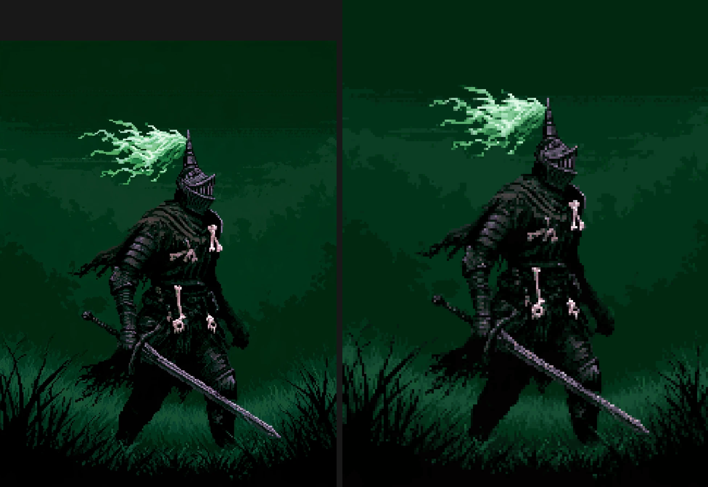 | 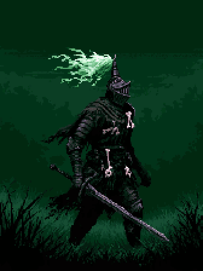 |
| Hearth beggar | 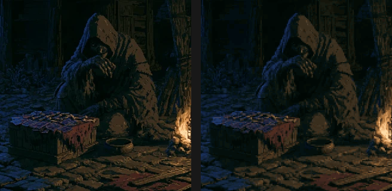 | 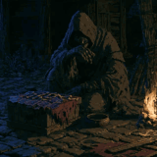 |

Commands used:

```sh
cd examples/output
pixelforge pixelate ../reference/lantern_wraith.webp -o wraith.png --remove-bg --crop --outline auto
pixelforge pixelate ../reference/grave_knight.webp  -o knight.png
pixelforge pixelate ../reference/hearth_beggar.webp -o beggar.png --max-size 160

pixelforge animate wraith.png -o wraith_anim --preset idle --effect "flicker:amount=0.12,threshold=0.5,box=0;0.3;0.4;0.7" --gif
pixelforge animate knight.png -o knight_anim --preset grass \
    --effect "sway:amplitude=2,anchor=bottom,box=0.2;0.1;0.65;0.35,wavelength=0.5,cycles=2" \
    --effect "flicker:amount=0.1,threshold=0.5,box=0.2;0.1;0.65;0.35" --gif
pixelforge animate beggar.png -o beggar_anim \
    --effect "flicker:amount=0.12,threshold=0.4,box=0.75;0.45;1;1,cycles=3" \
    --effect "breathe:amplitude=1,pivot=0.55,box=0.3;0.1;0.85;0.8" --gif
```

## Quality tiers, rotation and spin

```sh
pixelforge pixelate render.webp -o sprite.png --style 8bit    # 64px, 12 colors
pixelforge pixelate render.webp -o sprite.png --style 16bit   # 128px, 32 colors
pixelforge pixelate render.webp -o sprite.png --style snes    # 160px, 48 colors
pixelforge pixelate render.webp -o sprite.png --style hd      # 224px, 96 colors (default)

pixelforge rotate sprite.png -o sprite_left.png --flip h      # face the other way
pixelforge rotate sprite.png -o sprite_30.png  --angle 30     # any angle, no blur, no new colors
pixelforge rotate lantern.png -o spin --spin 12 --gif         # 12-frame spin for pickups / projectiles
```

| Rotated 30° (RotSprite, palette-locked) | 12-frame spin |
|---|---|
| 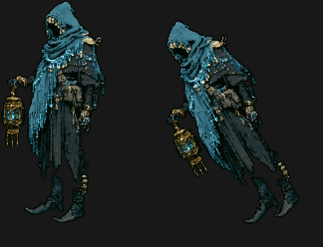 |  |

## A real Midjourney character sheet through the pipeline

`reference/wraith_sheet.webp` was made with prompt A. `pixelforge project run wraith split`
cut it into front / side / back with the background (and the white trapped
between the beads) removed; the front view became a sprite and a cloak-sway
clip via the quick path; `model` built the 3D mesh spec from it.

| Views cut from the sheet | Front sprite (hd) | Cloak clip |
|---|---|---|
| 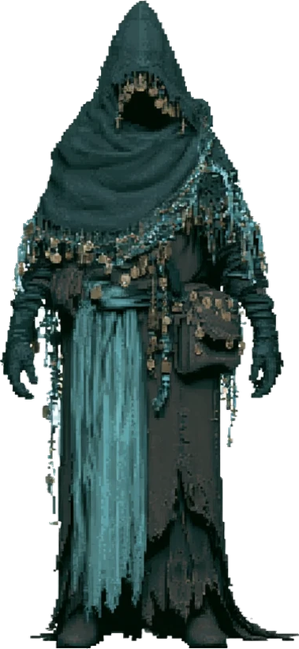 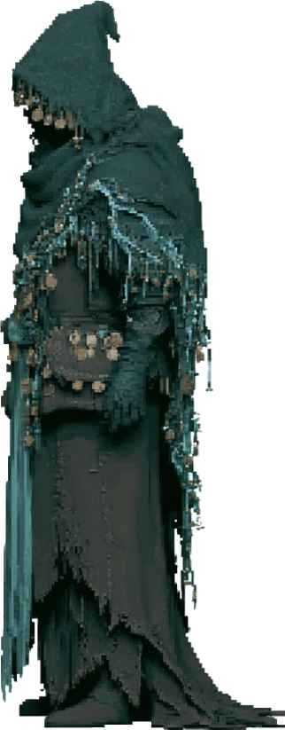 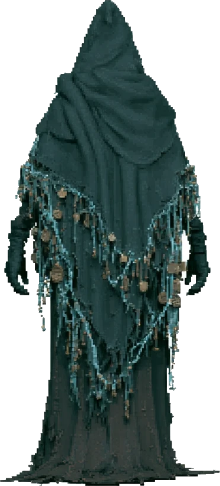 | 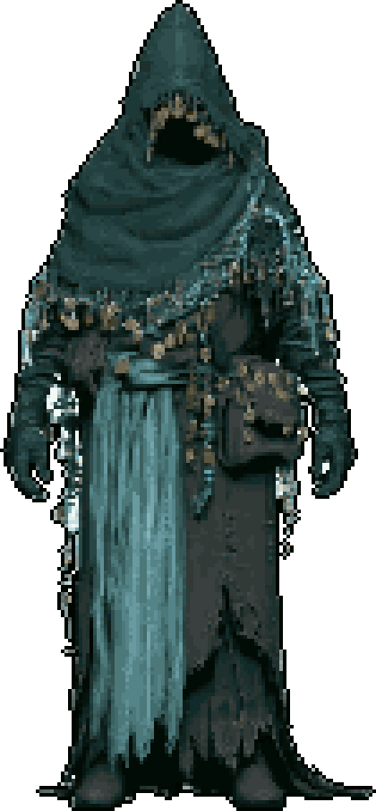 | 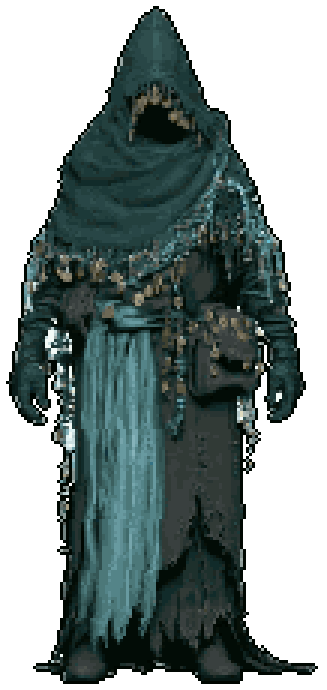 |

## Fully automatic character (motion library, no Mixamo)

The wraith sheet → carve → built-in rig with the CC0 motion library → 8-direction
render → pixelate → Godot. `output/wraith_godot/` holds the Godot files (one sheet
per action; only `wraith_walk.png` is committed as a sample).

| walk | attack | death |
|---|---|---|
| 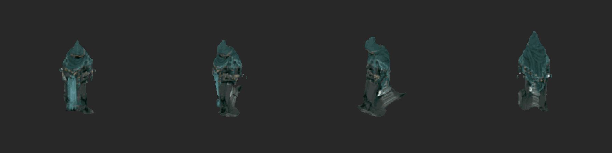 | 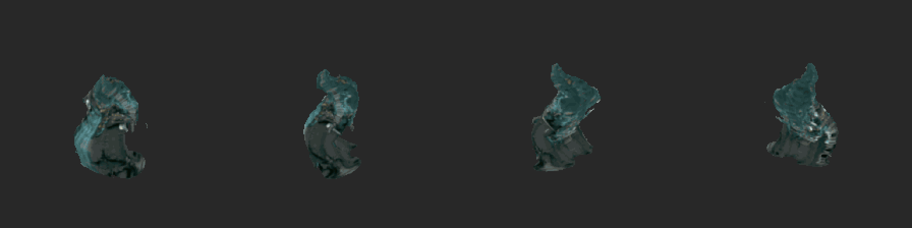 | 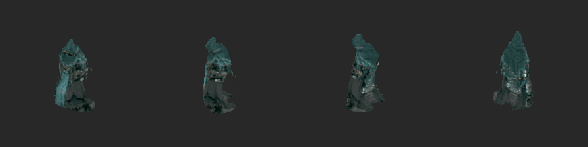 |
